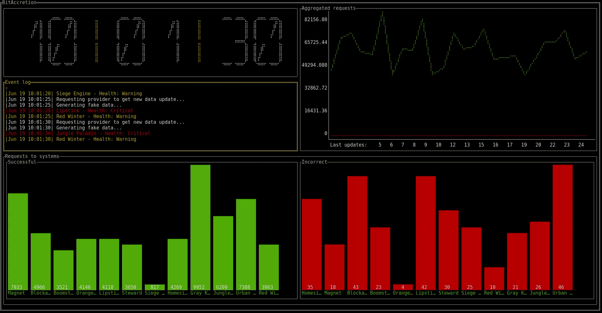

## BitAccretion

[](https://travis-ci.org/LinMAD/BitAccretion)

#### Why it's exist?
[Project plot on medium](https://medium.com/@artjomnemiro/how-valuable-can-be-visual-monitoring-923e9e865625)

```text
TODO Add system chart how it works
Expl:

Main -> Loading
Main -> Kernel
Kernel -> Dashboard
Kernel -> Processor
Kernel -> Sound
```

#### About
BitAccretion it's simple tool to aggregate metrics and visualize it. 

Based on Go plugins and allows you to implement specific graph assemblers to show them in the terminal dashboard.

The repository contains implemented New Relic API as a data provider but could be also based on Nginx logs aggregation or other sources. 

#### What it can do?
- Displaying terminal dashboard of graph(Systems and metrics) in charts representation.
- Sound alerts with System name if audio file exist.

#### Example how it's looks like



```text
TODO GOTTY in docker container to access from browser
TODO Remove clock and add degradation chart from exec time (Show error regression from exec time till now)
TODO Add to dashboard name processor name (to displace source of data)
```