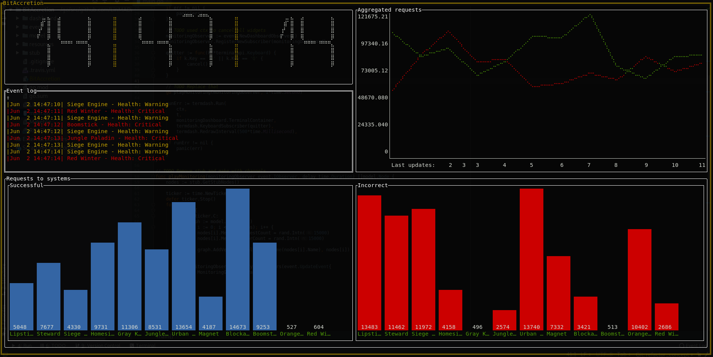

## BitAccretion

[](https://travis-ci.org/LinMAD/BitAccretion)

[Project plot on medium](https://medium.com/@artjomnemiro/how-valuable-can-be-visual-monitoring-923e9e865625)

```text
TODO Add more tests for critical code
TODO Add kernel where will be handled FSM to execute plugins dashboard etc

TODO Add system chart how it works
*TIP

main <-> kernel
kernel <=> FSM
kernel <-> plugin - provider
kernel <-> dashboard
```

New dashboard prototype

